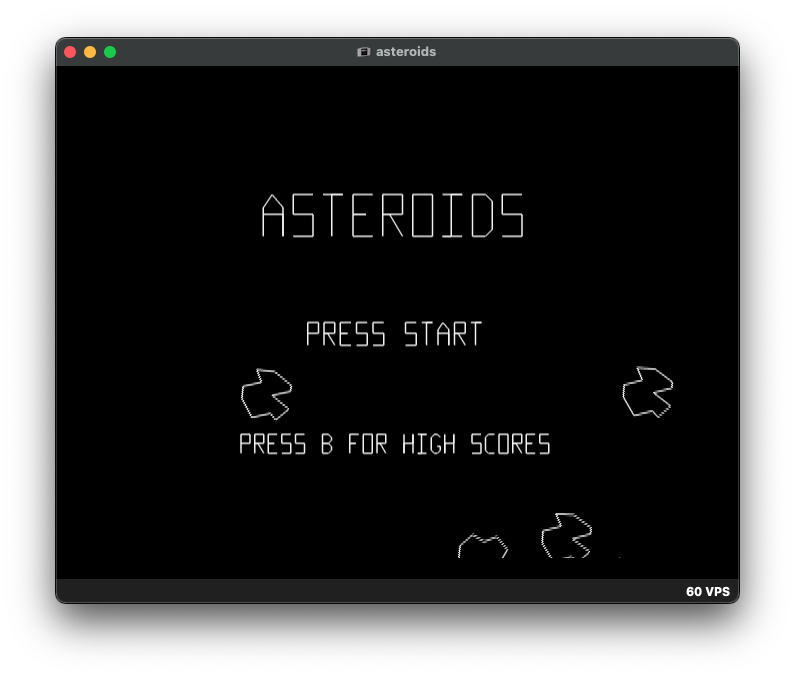
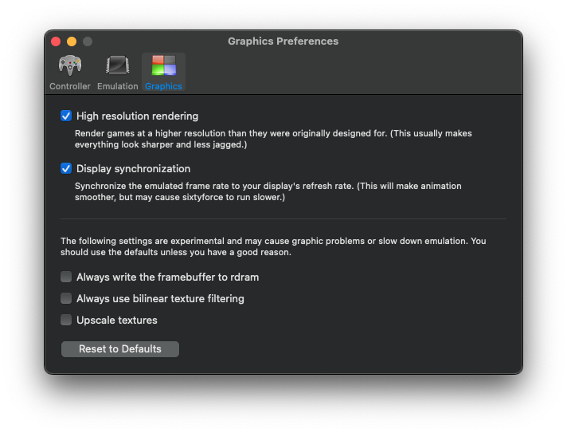
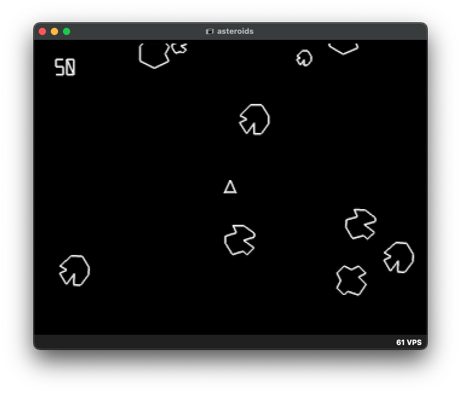

# Asteroids 64

This is the code for a Nintendo 64 port of my [Asteroids clone](https://github.com/tristanpenman/asteroids).

I've tried to maintain the original separation of concerns, so that the game logic is as similar as possible to the original implementation.

You can get the latest build [here](misc/asteroids.z64).

## Features

### Emulator Support

The code is frequently tested using [ares](https://ares-emu.net/) and [cen64](https://github.com/n64dev/cen64). It has also been tested using [Sixtyforce](https://sixtyforce.com/) on macOS and [Project64](https://www.pj64-emu.com/) on Windows.

Here are some screenshots of the game running in _ares_, showing the title screen:



### Real Hardware

The ROM can simply be copied to a flash cart such as the [EverDrive-64](https://krikzz.com/store/home/55-everdrive-64-x7.html). I've tested this using an X7 cart, however it should work on any flash cart.

### Rumble Pak

The game is compatible with Rumble Paks and Controller Paks.

When a Rumble Pak is inserted, it will be activated by ship explosions.

### Controller Pak

When an Controller Pak is inserted, high scores will be saved into a file on the Controller Pak.

## Build

This code can be compiled using CrashOverride95's [Modern SDK](https://crashoveride95.github.io/n64hbrew/modernsdk/index.html), which provides a modern Linux port of the Nintendo 64 SDK.

There are two options for compiling the source code. It is recommended that you use the fully self-contained Docker image in [Dockerfile.n64](Dockerfile.n64). Alternatively, you can manually install build dependencies on an Ubuntu- or Debian-compatible system.

### Docker

To compile using Docker, it is recommend that you have Docker Compose installed.

This will allow you to use a bundled build script to run the container. This will ensure that file permissions are set correctly, and tear down the container afterwards:

```
./scripts/n64.sh
```

### Option: Local Install

To install the build dependencies locally, you should follow CrashOverride95's [Getting Started](https://crashoveride95.github.io/modernsdk/startoff.html) guide. The steps are summarised below.

Start by adding the necessary apt repo:

```
echo "deb [trusted=yes] https://crashoveride95.github.io/apt/ ./" | sudo tee /etc/apt/sources.list.d/n64sdk.list
sudo apt update
sudo apt install binutils-mips-n64 gcc-mips-n64 newlib-mips-n64
```

Install the SDK (does not include nusys):

```
sudo apt install n64sdk n64-demos makemask
```

Install nusys and nusys demos:

```
sudo apt install nusys-demos
```

You may also need to set up the root compatibility environment:

```
sudo apt install root-compatibility-environment
sudo dpkg --add-architecture i386
```

Finally, make the following changes to `.bashrc` or `.profile`:
```
# N64
export N64_LIBGCCDIR="/opt/crashsdk/lib/gcc/mips64-elf/12.2.0"
export PATH=$PATH:/opt/crashsdk/bin
export ROOT=/etc/n64
```

### Make

Using either environment, there is a single Makefile:

```
make
```

This will output `build/asteroids.z64`.

## Testing

### Option: Low Resolution Mode

The game builds in high resolution mode (640x480) by default. This may not yet render correctly on some emulators. However, the ROM works on real hardware so I'm confident that the implementation is valid.

Some emulators (e.g Sixtyforce) will allow you to enable high resolution rendering in the settings:



To build in low resolution mode (320x240), alter the `DEFINES` at the top of the [Makefile](./Makefile) to include `LOW_RESOLUTION=1`. The graphics will not be as crisp, but the game is perfectly playable.

This screenshot shows low resolution mode in Ares:



### UNFLoader

The ROM can be loaded onto a flash cart via USB.

This repo contains a heavily modified version of the USB and Debug Library from [UNFLoader](https://github.com/buu342/N64-UNFLoader/) (see [usb.c](usb.c) and [debug.c](./debug.c)). I have removed code that was not relevant to this project, and modified some function signatures to better fit with the cross-platform needs of this project.

Even with the changes, you can still load the ROM using the original `UNFLoader` executable:

    UNFLoader -d -r build/asteroids.z64

The `-d` flag enables debug mode, and will show the output of `debug_printf` calls from the ROM in your terminal.

### Loader64

Before I discovered UNFLoader, I used a small C program called [loader64](https://github.com/tristanpenman/loader64). This was based on code written by [James Friend](https://github.com/jsdf), who has made a number of great contributions to the N64 Homebrew community.

## License

This code has been released under the MIT License. See the [LICENSE](LICENSE) file for more information.

### Assets

Game assets are under copyright by Atari.

The graphics and audio that have been reproduced here are all used in good faith. The clone is intentionally incomplete, so as to not detract from the value of any Atari releases of the game.
